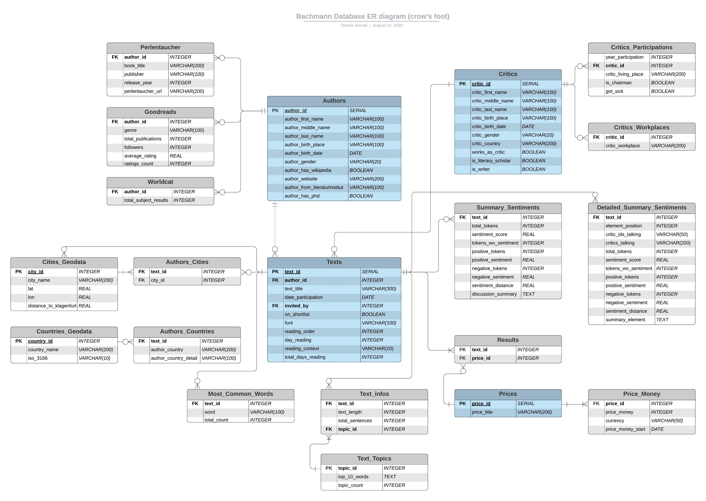
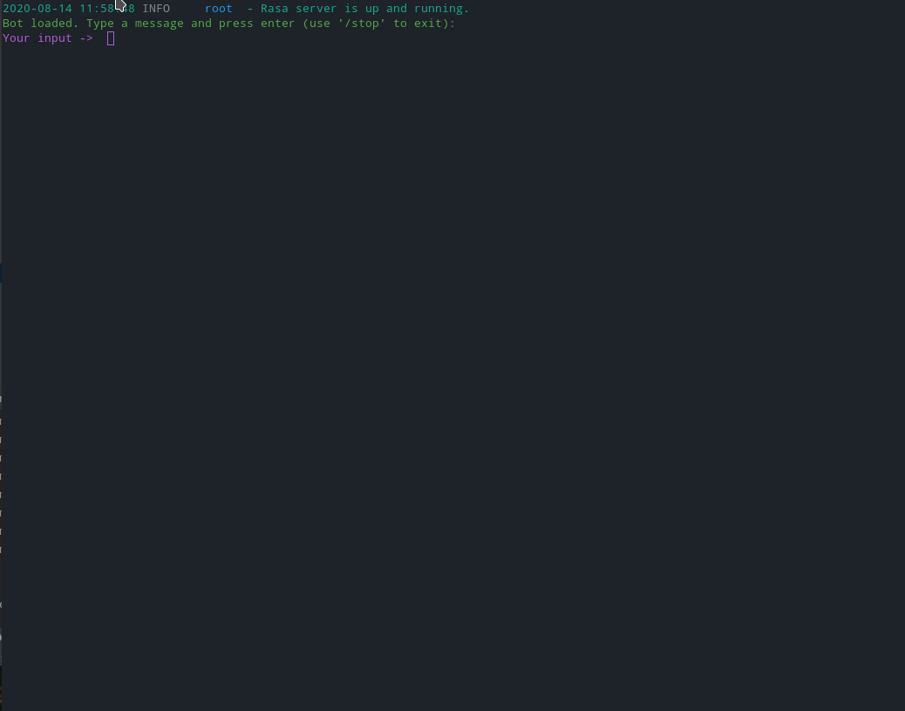

# Project: Bachmannpreis

### Background

The ['Tage der deutschsprachigen Literatur'](https://bachmannpreis.orf.at/) in Klagenfurt, Austria, is a major literary festival and basically the only one that is being televised on German television. This event consists of readings of 30 minutes by a number of invited writers who are being evaluated by a circle of critics. The culmination of the event is a live voting by the critics to determine which writers receive an award, most notably the Ingeborg-Bachmann-Preis. For several germanspeaking writers this event has been a starting or ending point for their literary career. 

### Structure

This project consists of five parts:

##### 1. Getting the data / Wrangling the data / Storing the data
* Scrape data about the event (Wikipedia, official website of Bachmannpreis) using [BeautifulSoup](https://www.crummy.com/software/BeautifulSoup/)
* Use [Goodreads API](https://www.goodreads.com/api) and [geopy](https://github.com/geopy/geopy) to acquire additional data
* Data Wrangling with [pandas](https://github.com/pandas-dev/pandas)
* Set up database with [PostgreSQL](https://www.postgresql.org/)

##### 2. NLP
* Sentiment analysis for jury discussion (with [spacy](https://spacy.io/) and [SentiWS](https://github.com/Liebeck/spacy-sentiws))
* NER and POS-tagging for texts using [flair](https://github.com/flairNLP/flair)
* Topic modeling with NMF and TFIDF

##### 3. Feature Engineering / Prediction
* Feature engineering for prediction within [pandas](https://github.com/pandas-dev/pandas)
* Predict winning authors with Random Forest model using [AutoSKLearn](https://automl.github.io/auto-sklearn/master/)

##### 4. Web application
* Deploy website using [Flask](https://github.com/pallets/flask) and [chart.js](https://github.com/chartjs/Chart.js)
* Live website: http://countbachmann.herokuapp.com

##### 5. Chatbot
* Deploy chatbot for user interaction ([Rasa](https://rasa.com/))

