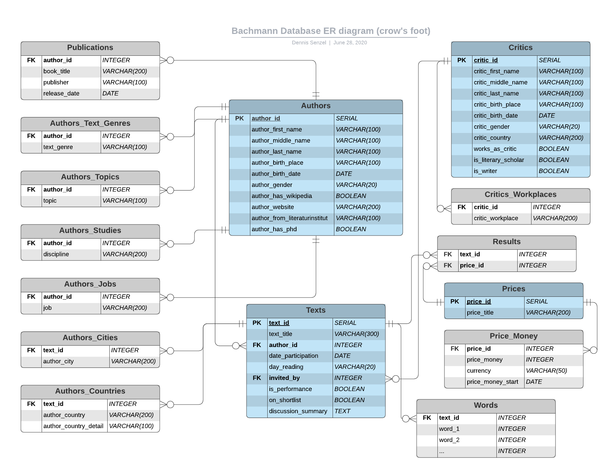

# Project: Bachmannpreis

### Background

The 'Tage der deutschsprachigen Literatur' in Klagenfurt, Austria, is a major literary festival and basically the only one that is being televised in German television. This event consists of readings of 30 minutes by a number of invited writers who are being evaluated by a circle of critics. The culmination of the event is a live voting by the critics to determine which writers receive an award, most notably the Ingeborg-Bachmann-Preis. For several germanspeaking writers this event has been a starting or ending point for their literary career. 

### Goal

* Scrape data about the event from the internet (wikipedia, official website of bachmannpreis) using BeautifulSoup
* Set up database with PostgreSQL
* Analyse data with Pandas
* Predict future winning authors with sklearn
* Deploy website using Flask
