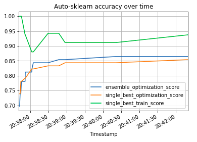

# Predicting the Bachmannpreis

### Description
A model to predict winning authors at the Bachmannpreis has to be at least better than a dummy model,
that predicts every participant to not win a prize. This dummy model already achieves an accuracy score 
of over 69%.  
Implementing a basic Random Forest model with scikit-learn gets an accuracy of around 72% without much fine-tuning.  
Auto-Sklearn makes it easy to perform efficient feature engineering. For this auto-sklearn runs over 2000 slightly varying
models to finally find a model that surpasses an accuracy score of over 84% on training data.  



### Usage
Auto-Sklearn is easiest run in a docker container. For installation instructions see [here](https://automl.github.io/auto-sklearn/master/installation.html).  
To start a Jupyter notebook inside the container use: 
```
docker run -it -v $PWD:/opt/nb -p 8888:8888 mfeurer/auto-sklearn:master /bin/bash -c "mkdir -p /opt/nb && jupyter notebook --notebook-dir=/opt/nb --ip='0.0.0.0' --port=8888 --no-browser --allow-root"
```
