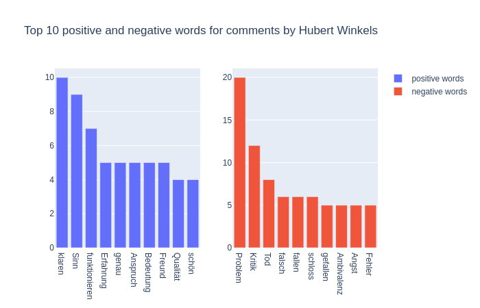
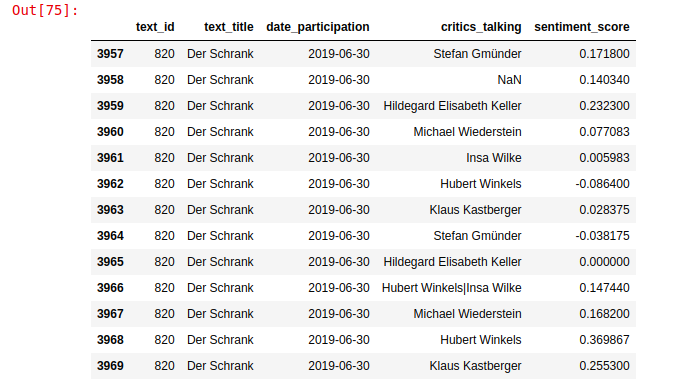

# Sentiment Analysis - Discussion Summaries

### Description

Sentiments are analyzed for discussion summaries of author performances.
Analysis is implemented with spacy and SentiWS and can be extracted for full summary or in more detail for every critic.

