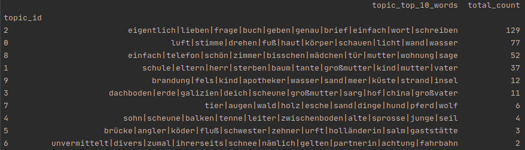
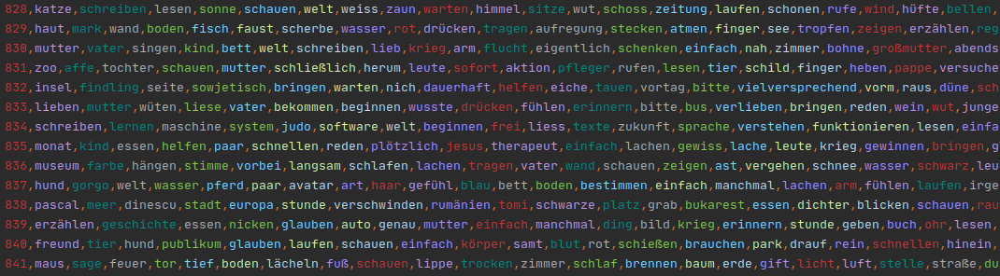

# Topic Modeling - Authors' Texts

### Description

Topic modeling is realized for available texts from the Bachmannpreis (1999-2020), in total 333 documents.
Sklearn's TfidfVectorizer and NMF model are used for topic modeling.  
Typical topics for the Bachmannpreis revolve around _writing_, _the body_, _family & death_, _the beach_, _grandparents & the attic_.  
For implementation of topic modeling see [here](https://github.com/senzelden/bachmannpreis/blob/master/topic_modeling/topic_modeling.py).

